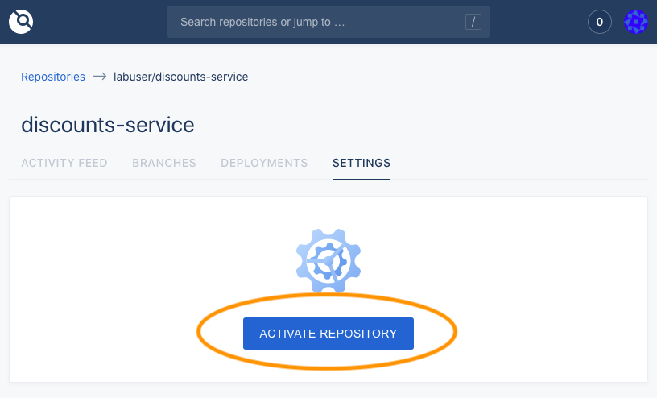
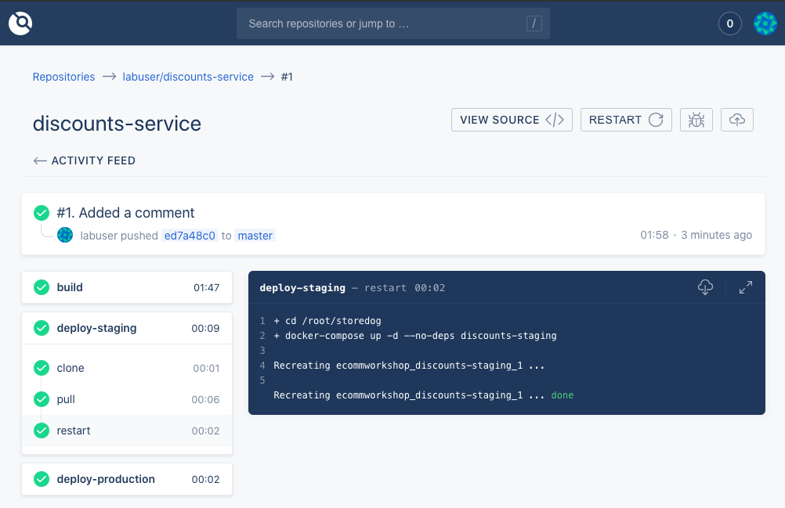

# Explore your lab environment & the CI/CD Pipeline
In the window to your right, you’ll see 6 tabs:
  - **Terminal** is the terminal that you’ll use to interact with the processes that comprise this scenario.
  - **IDE** is the development environment that you’ll use to change code, and utilize CI/CD configuration files that enable these tests to be set up.
  - **Production** is a production instance of Storedog.
  - **Staging** is running the staging instances of the Storedog frontend and discounts services. At this point, it is identical to the ‘production’ Storedog instance.
  - **Gogs** is an open source GitHub clone, and provides the user interface to the git repository that’s running in this lab. You’re not required to use it, but you can log in and explore the discounts service codebase –– if you're curious. The Gogs username is "labuser", and the password is "password".
  - **Drone** is the user interface to the Drone.io CI/CD tool running in this lab. There isn't much to explore at the moment, but it will become more interesting as you fire up a new discounts service build in a moment. The Drone login credentials are the same as those for Gogs: the username is "labuser", and the password is "password".

If you’re not able to see all of these tabs, please increase your browser window size and drag the vertical separator to widen the right-hand side of the view.

Right now it’s going to take a few minutes for all of these services to come online, so please feel free to read ahead and familiarize yourself with the activities in this lab –– or take a look at the Datadog Docs for [Synthetic CI/CD Testing](https://docs.datadoghq.com/synthetics/ci/?tab=apitest).

## Link Gogs and Drone
To start, you need to activate the Gogs git repository in the Drone interface. This creates the Gogs webhook that Drone will listen for to kick off build processes.
1. Click on the **Drone** tab above the terminal
1. Login as "**labuser**" with the password "**password**"
1. Click the **ACTIVATE** link to the right of **labuser/discounts-service** 
1. On the discounts-service repository page, click the **Activate Repository** button 
1. Click on the **Activity Feed** tab; you'll return here shortly to watch pipeline activity.

## Trigger a Build
To see this pipeline in action, we can make a minor change to the discounts service code in order to trigger a deployment. 

1. Click on the **IDE** tab above the terminal and give the editor a minute to start up. 
2. In the file tree, expand `lab/discounts-service`. This is a clone of the discounts service repository that’s stored in the local Gogs server.
3. Open `lab/discounts-service/discounts.py`{{open}} and then scroll to the bottom of the file. After the last line in the file, you can add a comment such as `# I added some new code!`. The editor will save your file changes automatically.

Now that you’ve updated the discounts service code, you have to push it to the repository in order to trigger a build. 

1. Click on the **Terminal** tab and run the command `cd /root/lab/discounts-service`{{execute}}.
2. Execute `git diff`{{execute}} to confirm that git is aware the new line you added
4. Execute `git commit -am "Added a comment"`{{execute}} to add a commit comment
5. Execute `git push`{{execute}} to push the changes up to the repository

Now that the git repository has been updated, Gogs will notify the Drone CI/CD tool that a `push` event occurred. Drone will now immediately clone the repository, and start building.

To see this in action:
1. Click the **Drone** tab, either above the terminal or on the one that’s already open in your browser.
3. On the `discounts-service` [Activity Feed](https://[[HOST_SUBDOMAIN]]-8800-[[KATACODA_HOST]].environments.katacoda.com/labuser/discounts-service/), you’ll see an entry corresponding to your git comment, "#1 Added a comment". Click on that entry.
4. Now take a look at the left-hand side, and observe the list of steps that Drone is configured to execute on this repository, along with their statuses. On the right-hand side, you can also see the detailed progress of each step.

At this point, it’ll be taking a few minutes for the build and deployment to complete. As they activate, click on each step in order to see the work that Drone is doing. The important steps to note here are the **deploy-staging** and **deploy-production** steps (which are currently identical).

For the next task, you’ll configure Drone to run a browser test before deploying to production.
